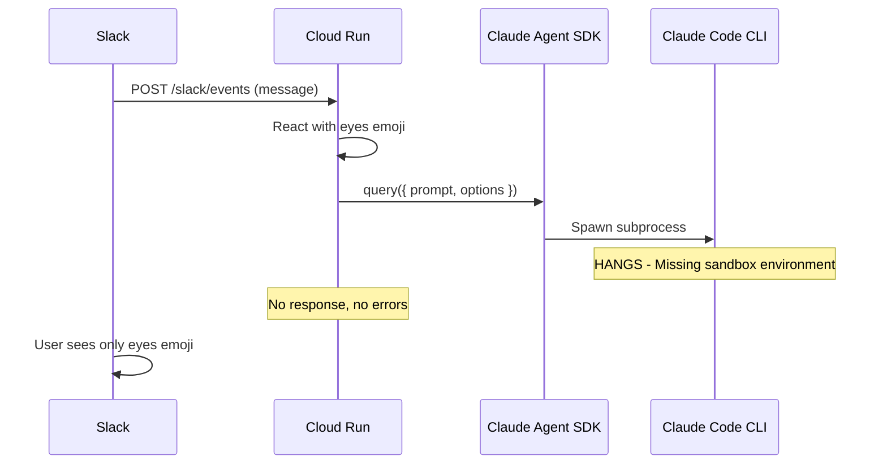
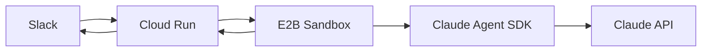

# Orion Slack Agent - Systematic Analysis and Course Correction

## Root Cause Analysis

### What Went Wrong

The architecture document made an assumption that Claude Agent SDK would work as a standard HTTP library on Cloud Run:

```markdown
| Constraint | Impact |
|------------|--------|
| **Claude Agent SDK (TypeScript)** | Primary agent framework, dictates tool patterns |
| **Cloud Run** | Stateless, auto-scaling |
```

**The Reality:** Claude Agent SDK is NOT a standard HTTP library. It:

1. Spawns Claude Code CLI as a **subprocess**
2. Requires specific **sandbox environments** (E2B, Vercel Sandbox, Modal, Fly Machines)
3. Needs process isolation, ephemeral filesystems, and network control that Cloud Run doesn't provide

### Evidence of the Problem



**Logs confirm this:** Processing stops at `query()` call with no errors - the subprocess either hangs or fails silently because Cloud Run lacks the sandbox features Claude Code expects.

### What Stories 3.1 and 3.2 Did

You asked about these - they added MCP infrastructure that is **redundant** because Claude Agent SDK handles MCP natively:

| Story | What It Added | SDK Already Provides |

|-------|--------------|---------------------|

| 3.1 MCP Client | Connection management, health checks | Built into SDK via `mcpServers` config |

| 3.2 Tool Registry | Tool discovery, schema caching | SDK auto-discovers tools during `query()` |

This added complexity but isn't the cause of the hang - the hang is from Cloud Run not supporting Claude Code subprocess.

---

## Three Options to Fix

### Option A: Switch to Standard Anthropic SDK (Recommended)

Replace Claude Agent SDK's `query()` with direct `@anthropic-ai/sdk` API calls.

**Changes Required:**

- Replace `query()` in [src/agent/loop.ts](src/agent/loop.ts) with `anthropic.messages.create()`
- Implement tool use manually via Messages API tool definitions
- Remove/simplify Stories 3.1/3.2 MCP infrastructure OR keep for Rube/Composio integration

**Pros:**

- Works on Cloud Run immediately (no infrastructure changes)
- Simpler, more predictable
- Full control over tool execution
- No subprocess dependencies

**Cons:**

- Lose Claude Agent SDK features: automatic subagent spawning, built-in compaction, native MCP orchestration
- Need to implement tool use patterns manually

**Effort:** 2-4 hours to get basic response working, additional time for tool integration

---

### Option B: Deploy on Supported Sandbox Environment

Move from Cloud Run to E2B, Vercel Sandbox, Modal, or Fly Machines.

**Changes Required:**

- Set up new infrastructure on E2B or Modal
- Update deployment pipeline
- Configure sandbox environment per Anthropic docs

**Pros:**

- Keep full Claude Agent SDK capabilities
- All Stories work as designed
- Native MCP, subagents, compaction

**Cons:**

- New infrastructure to learn and manage
- Potentially higher costs
- E2B/Modal have different scaling models than Cloud Run

**Effort:** 4-8 hours for infrastructure setup and testing

---

### Option C: Hybrid Architecture (Cloud Run + E2B)

Keep Cloud Run for Slack, call E2B sandbox for agent execution.



**Changes Required:**

- Add E2B SDK to project
- Create wrapper that sends query to E2B sandbox
- E2B runs Claude Agent SDK query

**Pros:**

- Best of both worlds
- Slack handling stays on reliable Cloud Run
- Agent execution gets proper sandbox

**Cons:**

- Most complex architecture
- Two systems to maintain
- Additional latency from Cloud Run → E2B hop

**Effort:** 6-10 hours

---

## Recommendation

**Go with Option A (Standard Anthropic SDK)** because:

1. **Fastest to working state** - Can have Orion responding in 2-4 hours
2. **Simplest architecture** - One deployment target, no subprocess dependencies
3. **Your agent loop already works** - The Gather → Act → Verify pattern in [src/agent/loop.ts](src/agent/loop.ts) is solid
4. **MCP can still work** - Rube/Composio can be called directly via their APIs
5. **Upgrade path exists** - Can migrate to Option B or C later if needed

### Implementation Steps for Option A

1. **Replace `query()` with direct Anthropic SDK calls** in [src/agent/loop.ts](src/agent/loop.ts)
2. **Simplify stream handling** - Remove complex tool tracking (SDK was handling this)
3. **Test basic response** - Get "Hello from Orion" working first
4. **Add tool integration** - Re-add Rube/Composio via direct API calls if needed
5. **Remove unused complexity** - Clean up Stories 3.1/3.2 infrastructure that's now redundant

---

## Decision Needed

Which option would you like to proceed with?

- **Option A:** Standard Anthropic SDK (Recommended - fastest, simplest)
- **Option B:** Deploy on E2B/Modal (keeps full SDK features)
- **Option C:** Hybrid Cloud Run + E2B (best of both but complex)