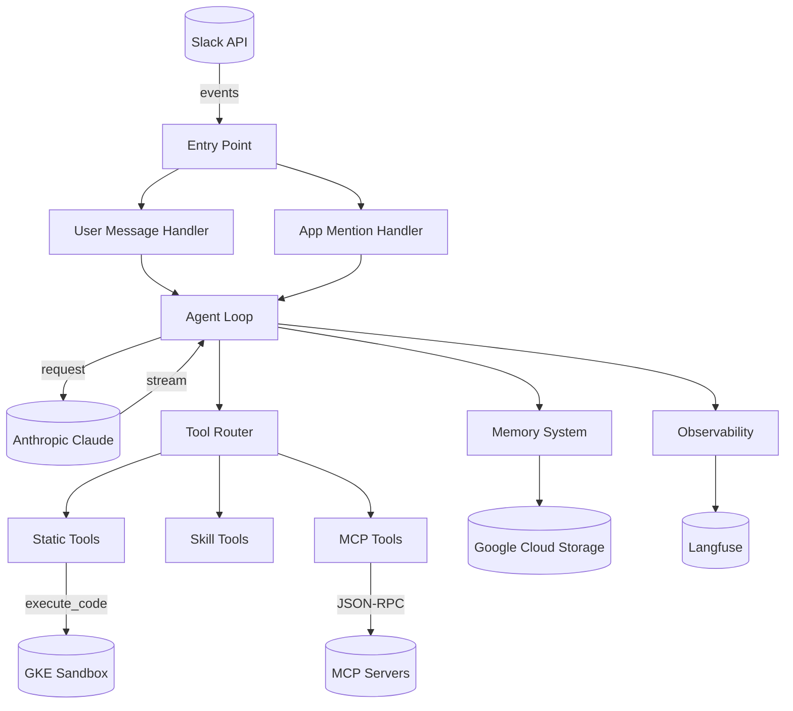
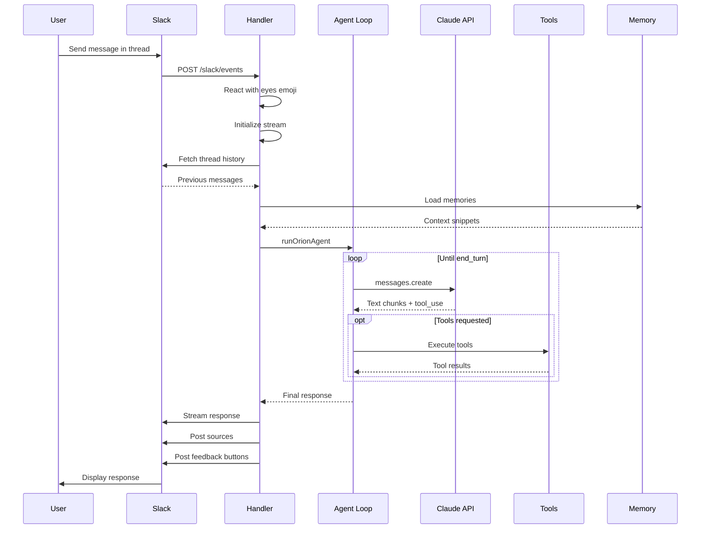
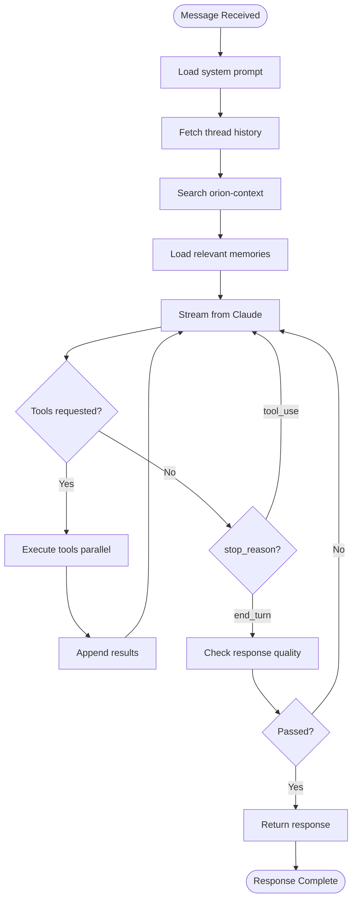
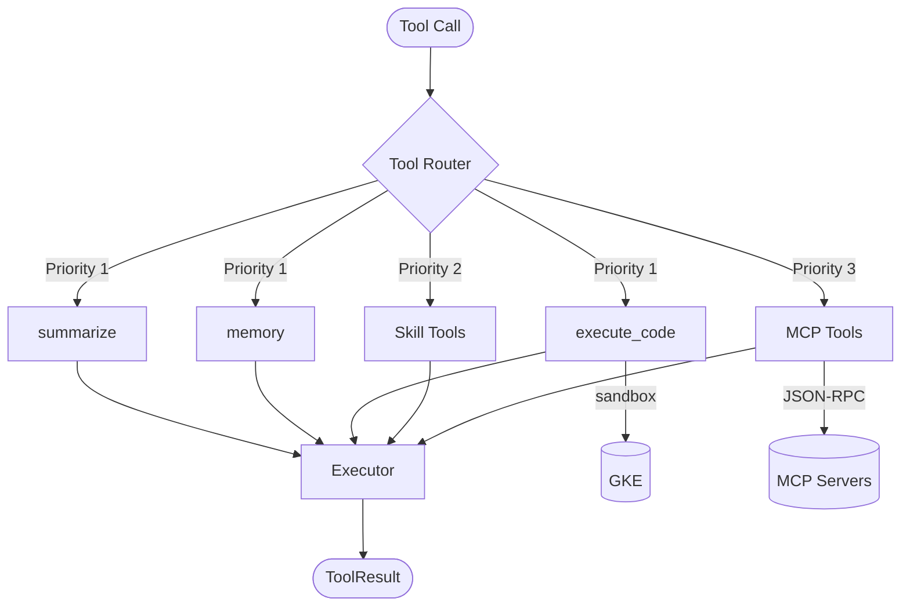
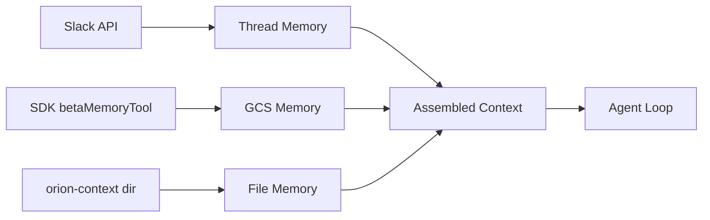
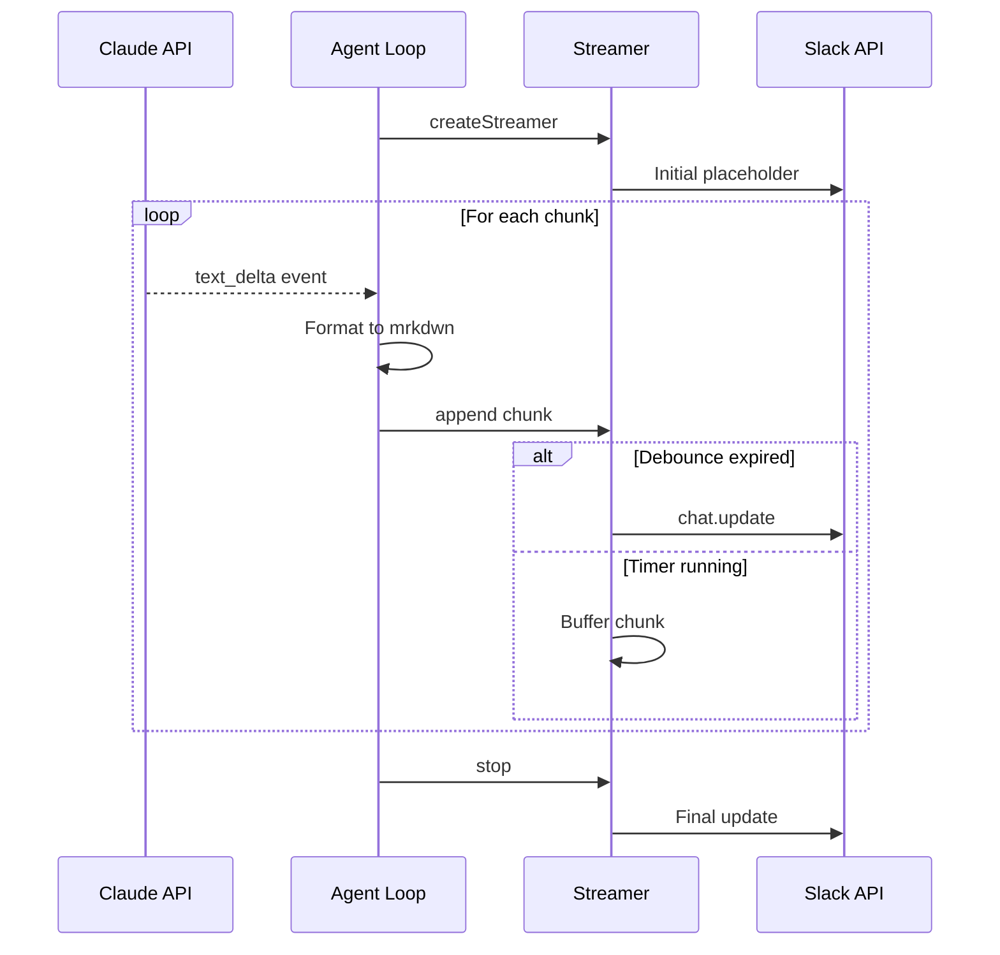
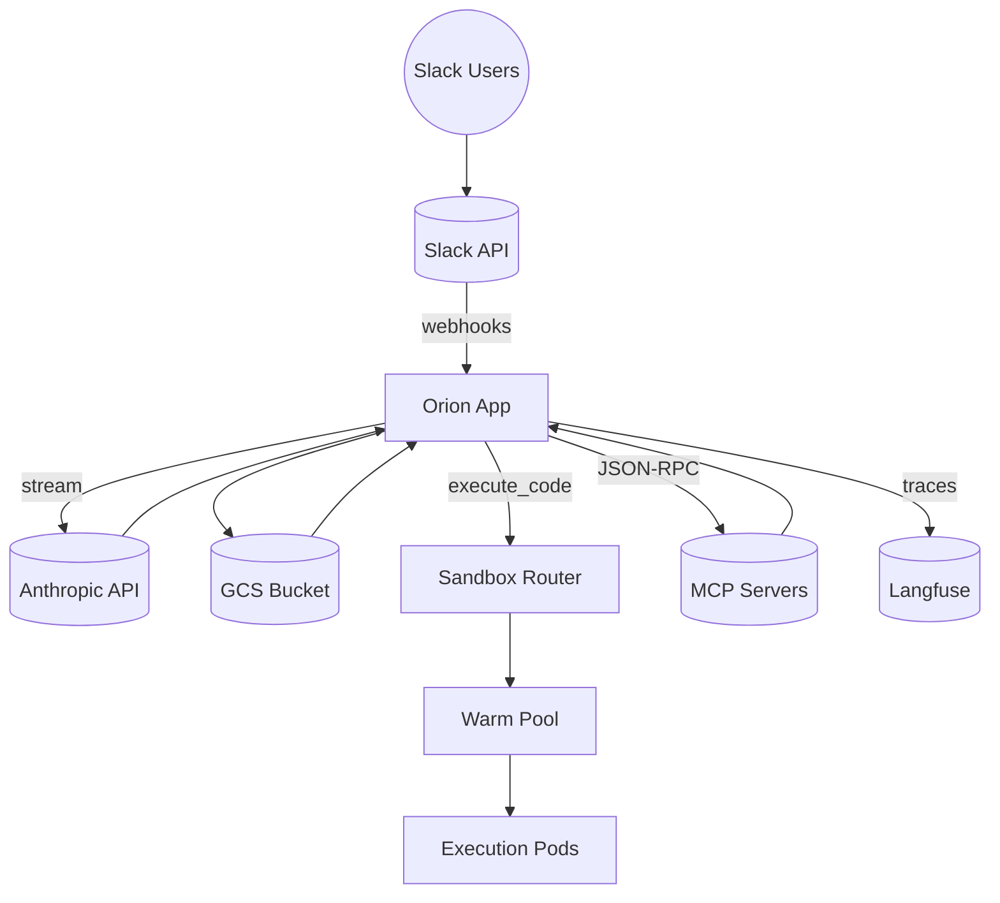

# Orion Slack Agent — Architecture Documentation

This document explains the complete backend architecture of Orion, an AI-powered Slack assistant built on Claude. Each section includes a Mermaid diagram followed by a brief explanation.

---

## Tech Stack

| Layer | Technology | Purpose |
|-------|------------|---------|
| Runtime | Node.js 20+ / TypeScript 5.7 | Application runtime |
| Slack | @slack/bolt 4.6 | Event handling, messaging |
| AI | Anthropic Claude API | LLM reasoning and responses |
| Storage | Google Cloud Storage | Memory persistence |
| Compute | GKE Autopilot | Sandboxed code execution |
| Tools | MCP (Model Context Protocol) | External tool integrations |
| Observability | Langfuse + OpenTelemetry | Tracing and metrics |

---

## 1. High-Level Architecture

**What are all the pieces and how do they connect?**

### Key Points
- **Entry** receives all Slack events via webhook (Cloud Run) or WebSocket (local dev)
- **Handlers** route events to the appropriate processing flow
- **Agent Loop** orchestrates the AI reasoning cycle
- **Tool System** provides three tiers of capabilities
- **Memory** gives context from multiple sources
- **Observability** traces every request end-to-end

---

## 2. Request Lifecycle

**How does a user message flow through the system?**

### Key Points
1. **Acknowledgment** — Eyes emoji within milliseconds
2. **Stream init** — Must start within 500ms (NFR4)
3. **Context loading** — Thread history + memories loaded before agent runs
4. **Tool loop** — Agent can call tools up to 10 times per request
5. **Rich response** — Includes sources, feedback buttons, and follow-ups

---

## 3. Agent Loop

**What does the AI agent actually do?**

### Phase Breakdown

| Phase | Purpose | Key Actions |
|-------|---------|-------------|
| **GATHER** | Load context | System prompt, thread history, memories |
| **ACT** | Generate response | Stream from Claude, execute tools (max 10 loops) |
| **VERIFY** | Quality check | Validate response, retry if needed (max 3) |

### Key Points
- **GATHER** — Lightweight context loading (no embeddings, keyword matching only)
- **ACT** — Streaming response with tool execution loop (max 10 iterations)
- **VERIFY** — Quality check with retry capability (max 3 attempts)
- Tools execute in parallel via `Promise.all()` with individual error handling

---

## 4. Tool Execution

**How do tools get routed and executed?**

### Tool Tiers

| Tier | Priority | Tools | Source |
|------|----------|-------|--------|
| **Static** | 1st | summarize, memory, execute_code | Built-in at startup |
| **Skill** | 2nd | skillName__toolName | .orion/agents/*.md |
| **MCP** | 3rd | serverName__toolName | External servers |

### Executor Settings

| Setting | Value |
|---------|-------|
| Timeout | 30 seconds |
| Retries | 3 attempts |
| Rate limit backoff | 30 seconds |

### Key Points
- **Priority order** — Static (built-in) → Skill (loaded) → MCP (external)
- **Static tools** are registered at startup
- **Skill tools** are loaded on-demand from `.orion/agents/` directory
- **MCP tools** connect to external servers via HTTP JSON-RPC
- **Executor** applies consistent timeout, retry, and error handling

---

## 5. Memory System

**Where does context come from?**

### Three Memory Layers

| Layer | Source | When Loaded | Persistence |
|-------|--------|-------------|-------------|
| **Thread** | Slack API | Every request | Session |
| **GCS** | SDK betaMemoryTool | On tool call | Permanent |
| **File** | orion-context/ | At gather phase | Project lifetime |

### Constraints

| Constraint | Value |
|------------|-------|
| Thread messages | Max 50 |
| Thread tokens | Max 4000 |
| Memory file size | Max 100KB |

### Key Points
- **Thread Memory** — Always loaded, provides conversation continuity
- **GCS Memory** — Claude controls via SDK tool, persists across sessions
- **File Memory** — Project knowledge, searched by keywords at gather phase
- Each layer serves a different purpose and lifetime

---

## 6. Streaming Response

**How do Claude's responses reach Slack?**

### Timing Constraints

| Constraint | Value | Purpose |
|------------|-------|---------|
| First token | < 500ms | User experience (NFR4) |
| Update debounce | 250ms | Avoid rate limits |
| Word boundaries | Yes | Clean display |

### Key Points
- **Placeholder message** — Posted immediately to show typing indicator
- **Debouncing** — Updates batched every 250ms to avoid rate limits
- **Word boundaries** — Chunks buffered to avoid mid-word updates
- **First token** — Must appear within 500ms (NFR4 requirement)

---

## 7. Deployment Infrastructure

**How are the services deployed and connected?**

### GCP Components

| Service | Purpose |
|---------|---------|
| **Cloud Run** | Hosts Orion app, auto-scales, port 8080 |
| **GKE Autopilot** | Manages sandbox pods for code execution |
| **GCS Bucket** | Persistent storage for memories |

### GKE Sandbox Details

| Component | Value |
|-----------|-------|
| Cluster | orion-sandbox-cluster |
| Region | us-central1 |
| Warm Pool | 2 replicas |
| Runtime | Python 3.11 |

### Key Points
- **Cloud Run** — Stateless container, auto-scales, receives Slack webhooks
- **GKE Autopilot** — Manages sandbox pods for code execution
- **Warm Pool** — Pre-warmed pods (2 replicas) for fast execution start
- **GCS Bucket** — Persistent storage for memories
- **External services** — All accessed via HTTPS

---

## Quick Reference

### Key Constraints

| Constraint | Value | Purpose |
|------------|-------|---------|
| Request timeout | 4 minutes | Hard limit (AR20) |
| First token | < 500ms | User experience (NFR4) |
| Tool timeout | 30 seconds | Prevent hung tools |
| Tool loop max | 10 iterations | Prevent infinite loops |
| Verification retries | 3 attempts | Quality assurance |
| Slack debounce | 250ms | Avoid rate limits |
| Thread history | 50 msgs / 4000 tokens | Context budget |

### Critical File Paths

| Component | Path |
|-----------|------|
| Entry point | `src/index.ts` |
| Agent loop | `src/agent/loop.ts` |
| User message handler | `src/slack/handlers/user-message.ts` |
| Tool router | `src/tools/router.ts` |
| Tool executor | `src/tools/execution.ts` |
| MCP client | `src/tools/mcp/client.ts` |
| Memory system | `src/memory/index.ts` |
| Streaming | `src/utils/streaming.ts` |
| Tracing | `src/observability/tracing.ts` |
| Config | `src/config/environment.ts` |
| System prompt | `.orion/agents/orion.md` |
| MCP config | `.orion/config.yaml` |

---

## Summary

Orion is a **three-phase agent** (Gather → Act → Verify) that:

1. Receives Slack messages via webhooks
2. Loads context from thread history, GCS, and local files
3. Streams responses from Claude with tool execution support
4. Routes tool calls through a 3-tier system (Static → Skill → MCP)
5. Delivers responses to Slack with debounced streaming
6. Traces everything to Langfuse for observability

The architecture prioritizes **responsiveness** (< 500ms first token), **reliability** (retries, timeouts), and **extensibility** (pluggable tools via MCP).
